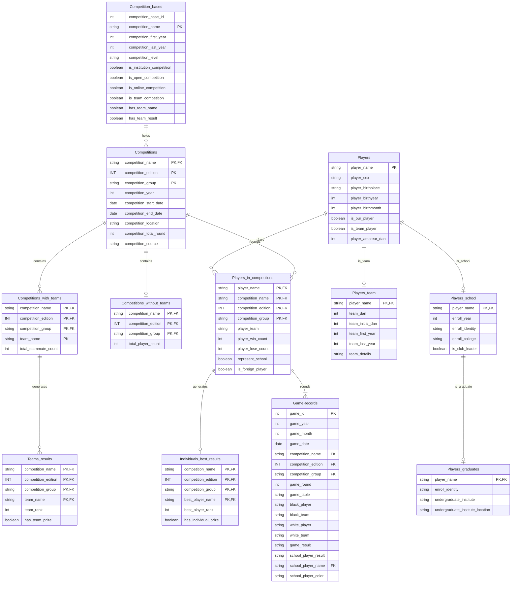

```mermaid
erDiagram
    %% 比赛相关实体
    Competition_bases {
        int competition_base_id 
        string competition_name PK
        int competition_first_year
        int competition_last_year
        string competition_level
        boolean is_institution_competition
        boolean is_open_competition
        boolean is_online_competition
        boolean is_team_competition
        boolean has_team_name
        boolean has_team_result
    }

    Competitions {
        string competition_name PK,FK
        INT competition_edition PK
        string competition_group PK
        int competition_year
        date competition_start_date
        date competition_end_date
        string competition_location
        int competition_total_round
        string competition_source
    }

    Competitions_with_teams {
        string competition_name PK,FK
        INT competition_edition PK,FK
        string competition_group PK,FK
        string team_name PK
        int total_teammate_count
    }

    Competitions_without_teams {
        string competition_name PK,FK
        INT competition_edition PK,FK
        string competition_group PK,FK
        int total_player_count
    }

    %% 选手相关实体
    Players {
        string player_name PK
        string player_sex
        string player_birthplace
        int player_birthyear
        int player_birthmonth
        boolean is_our_player
        boolean is_team_player
        int player_amateur_dan
    }

    Players_school {
        string player_name PK,FK
        int enroll_year
        string enroll_identity
        string enroll_college
        boolean is_club_leader
    }

    Players_graduates {
        string player_name PK,FK
        string enroll_identity
        string undergraduate_institute
        string undergraduate_institute_location
    }

    Players_team {
        string player_name PK,FK
        int team_dan
        int team_initial_dan
        int team_first_year
        int team_last_year
        string team_details
    }

    %% 比赛参与相关实体
    Players_in_competitions {
        string player_name PK,FK
        string competition_name PK,FK
        INT competition_edition PK,FK
        string competition_group PK,FK
        string player_team 
        int player_win_count
        int player_lose_count
        boolean represent_school
        boolean is_foreign_player
    }

    Teams_results {
        string competition_name PK,FK
        INT competition_edition PK,FK
        string competition_group PK,FK
        string team_name PK,FK
        int team_rank
        boolean has_team_prize
    }

    Individuals_best_results {
        string competition_name PK,FK
        INT competition_edition PK,FK
        string competition_group PK,FK
        string best_player_name PK,FK
        int best_player_rank
        boolean has_individual_prize
    }

    GameRecords {
        int game_id PK
        int game_year
        int game_month
        date game_date
        string competition_name FK
        INT competition_edition FK
        string competition_group FK
        int game_round
        string game_table
        string black_player 
        string black_team
        string white_player
        string white_team
        string game_result
        string school_player_result
        string school_player_name FK
        string school_player_color
    }

    %% 观众相关实体
    %%Audiences_in_competitions {
    %%    string audience_name PK
    %%    string competition_name PK,FK
    %%    string competition_edition PK,FK
    %%    string competition_group PK,FK
    %%}
    
    %% 关系定义
    Competition_bases ||--o{ Competitions : holds
    Competitions ||--o{ Competitions_with_teams : contains
    Competitions ||--o| Competitions_without_teams : contains

    Players ||--o| Players_school : is_school
    Players_school ||--o| Players_graduates : is_graduate
    Players ||--o| Players_team : is_team

    Players ||--o{ Players_in_competitions : plays
    Competitions ||--o{ Players_in_competitions : records
    %%Competitions_with_teams |o--o{ Players_in_competitions : records
    %%Competitions ||--o{ Audiences_in_competitions : records

    Competitions_with_teams ||--o{ Teams_results : generates
    Players_in_competitions ||--o| Individuals_best_results : generates
    Players_in_competitions ||--|{ GameRecords : rounds
```